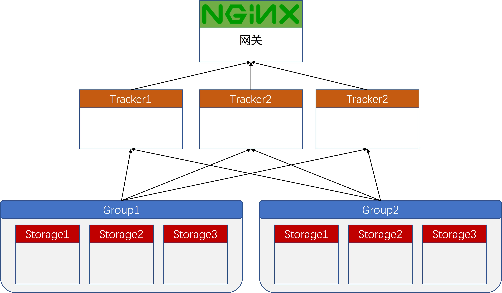
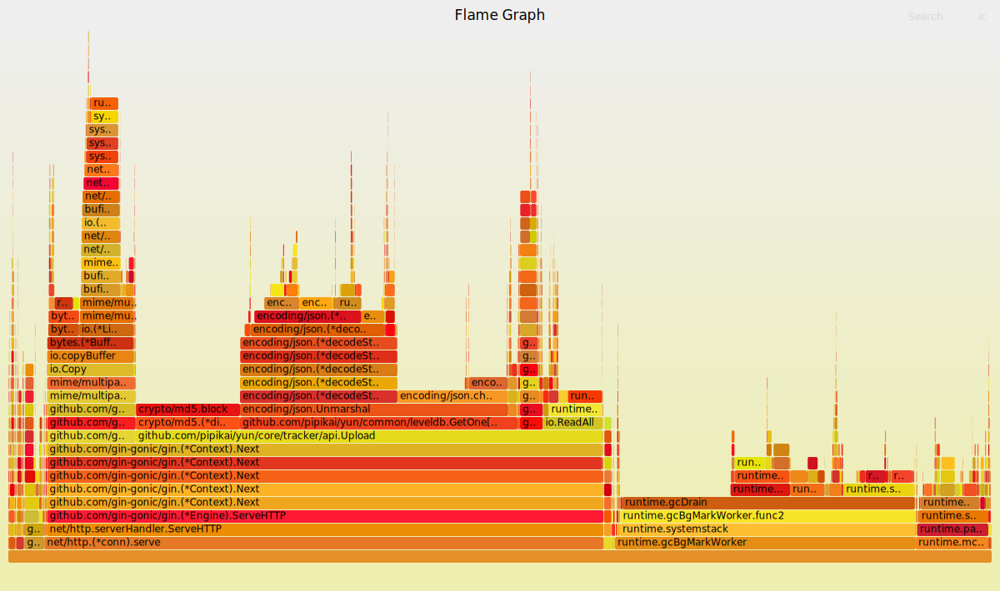
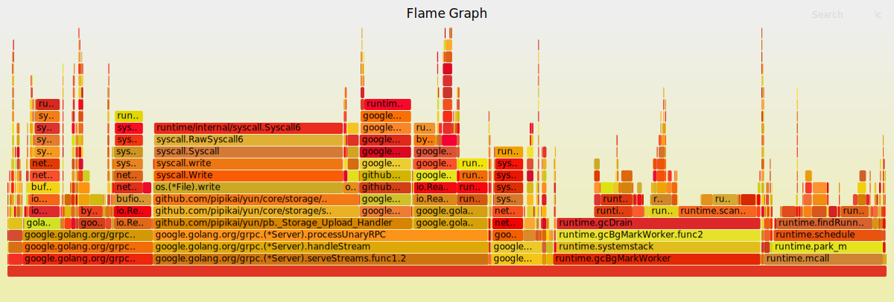

# YUN


[](http://hits.dwyl.com/pipikai/yun)

[](https://app.codacy.com/gh/PIPIKAI/yun/dashboard?utm_source=gh\&utm_medium=referral\&utm_content=\&utm_campaign=Badge_grade?style=flat-square)
[](https://goreportcard.com/report/github.com/pipikai/yun)


## 项目介绍

这个项目是一个使用Golang语言实现的分布式文件存储系统，它以插件的形式，可以实现对不同的文件源的支持，例如不仅仅可以将文件保存在本地，支持将文件保存到各大云盘，如OneDrive，百度云，阿里云、各大品牌NAS...，此外它具有跨平台、高可用、高性能、易拓展、支持文件的秒传、断点续传、分片上传等特性。此外，该存储系统还支持大文件的上传，并通过embed集成了GUI界面，方便用户使用。

## 安装说明

这个项目是一个Linux或Windows系统下的二进制可执行文件，不需要安装任何依赖项。只需要按照以下步骤进行即可：

1.  下载最新版本的可执行文件：

```bash
wget https://github.com/PIPIKAI/yun/releases/latest/download/yun-linux-amd64
```

2.  控制台中执行以下命令来启动客户端或存储端：

启动客户端：

```bash
./yun start --f "tracker"
```

启动存储端：

```bash
./yun start --f "storage" 
```


ToDo List:

- [x]  文件同步(实时，定时，周期性文件同步)


- [ ]  客户端生成配置文件，热加载配置文件

## 拓展性

通过实现对应的接口，存储服务端可以实现不同的存储类型，例如支持各大云盘，如OneDrive，百度云，阿里云、各大品牌NAS...

举例：

Step1：

在`core/storage/drivers`目录下新建文件夹 one_drive

Step2:

完成`core/storage/drivers/vo/idrivers.go`文件中的对应的Driver接口、
```golang
type Driver interface {
	GetAddition() Addition
	Init(context.Context) error
	Readder
	Writter
}
```
Step3:

创建对应的初始化函数

```golang
func New() *Local {
	return &Local{}
}
```
并在`core/storage/drivers/enter.go`文件中注册对应的Driver
```golang
var DriverCenter = map[string]vo.Driver{
	"OneDrive": one_drive.New(),
}
```

## 业务设计

以下是一些使用示例，展示如何使用这个项目。

上传文件

<!-- ToDo -->

- 整体架构：



- 文件同步：


## 火焰图

upload时应用服务器性能分析



upload时存储服务器性能分析


## 贡献指南

我们欢迎任何形式的贡献，包括但不限于：报告问题、提交bug修复、改进文档和代码等。如果您想做出贡献，请按照以下步骤进行：

1.  Fork这个项目，并克隆到本地。
2.  在本地分支中进行修改。
3.  提交Pull Request，描述您的修改内容和用途。

## 许可证信息

本项目基于MIT许可证开放源代码。

## 联系方式

如果您对这个项目有任何问题或建议，请通过以下方式联系我们：

*   发送邮件到 z1652091948@outlook.com
*   在GitHub上提交问题

感谢您的使用和贡献！
